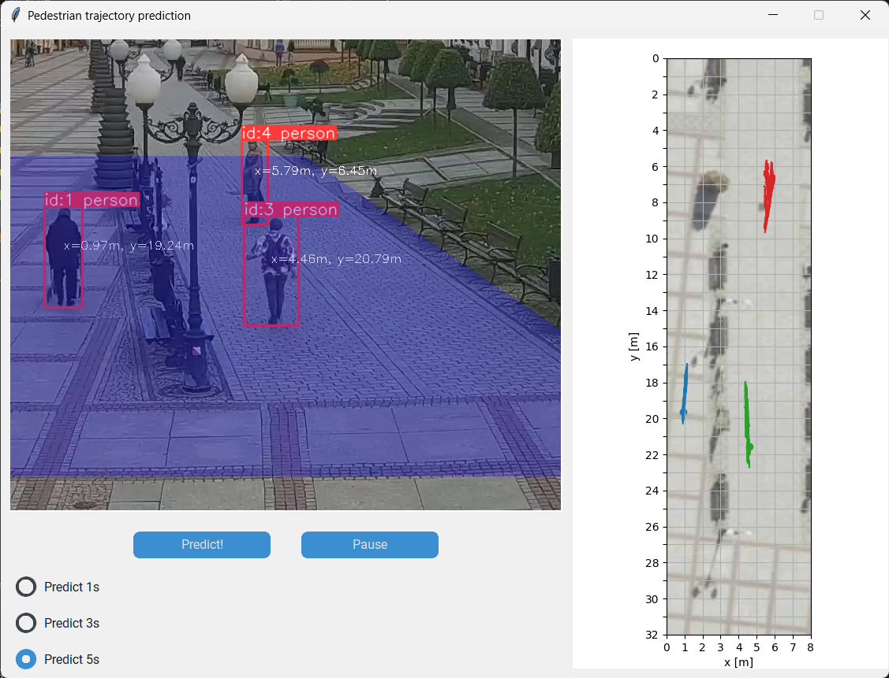

# Pedestrian trajectory prediction
Discrete systems simulation project, featuring:
- videos acquisition,
- human trajectory data extraction using [Ultralytics YOLOv8](https://github.com/ultralytics/ultralytics),
- human trajectory prediction in window app, with plan projection.

---

## Usage
`python main.py [--model <path_to_predicting_model>]`, then follow GUI instructions.
